# Flutter ATM Simulation

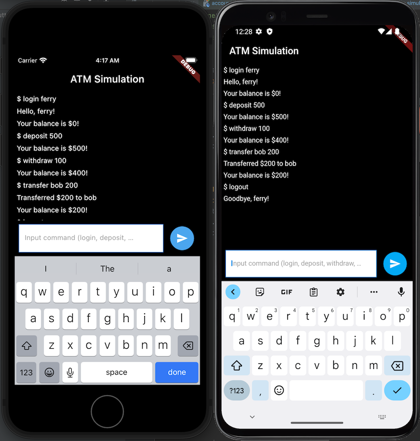

This project is a flutter app of ATM simulation.

## Table of Contents
1. [Project Summary](#project-summary)
2. [Configure and Run Project](#configure-and-run-project)
3. [Project Architecture](#project-architecture)
4. [Application Features](#application-features)
5. [Code Coverage](#code-coverage)

## Project Summary
This Project is using several design patterns and libraries:
1. Version management: [Flutter Version Manager (FVM)](https://fvm.app/)
2. Modularization: [Melos](https://melos.invertase.dev/)
3. IDE: Android Studio
4. Project Architecture: Clean Architecture
5. State Management: [Bloc](https://pub.dev/packages/flutter_bloc)
6. Dependency Injection: [GetIt](https://pub.dev/packages/get_it), [Injectable](https://pub.dev/packages/injectable)
7. Navigation: [AutoRoute](https://pub.dev/packages/auto_route) 
8. Data Class Code Generator: [Freezed](https://pub.dev/packages/freezed), [JSON Serializable](https://pub.dev/packages/json_serializable)
9. Persistent Storage: [Shared Preferences](https://pub.dev/packages/shared_preferences)
10. Unit test: [Mocktail](https://pub.dev/packages/mocktail), [Http Mock Adapter](https://pub.dev/packages/http_mock_adapter), [Bloc Test](https://pub.dev/packages/bloc_test)
11. Widget test: [BDD Widget Test](https://pub.dev/packages/bdd_widget_test)

[back to top](#table-of-contents)

## Configure and Run Project
Application is tested and run in `Android` and `iPhone` devices.

To configure and run the project, you need to follow this step:
1. Install and configure [Flutter](https://docs.flutter.dev/get-started/install)
2. Install and configure version manager [Flutter Version Manager (FVM)](https://fvm.app/docs/getting_started/installation/)
```
dart pub global activate fvm
```
2. Install and configure workspace management: [Melos](https://melos.invertase.dev/getting-started)
```
dart pub global activate melos
```
3. Make sure all `PATH` has been configured. You can test it by run this in terminal
```
fvm --version
melos --version
```
4. Open `flutter_atm` in your IDE (Author use `Android Studio`)
5. Setup `flutter local sdk project` (Author use flutter version `3.7.7`)
```
fvm install
```
6. Setup all dependencies using `Melos`

This will run `flutter pub get` to all packages
```
melos bootstrap
```
7. Generate all code generator
```
melos generate
```
8. Connect devices or start `Android Emulator` or `iPhone Simulator`
9. Run the app from IDE to Android or iPhone device or you can browse and run `main.dart`
```
packages/app_atm/lib/main.dart
```

[back to top](#table-of-contents)

## Project Architecture
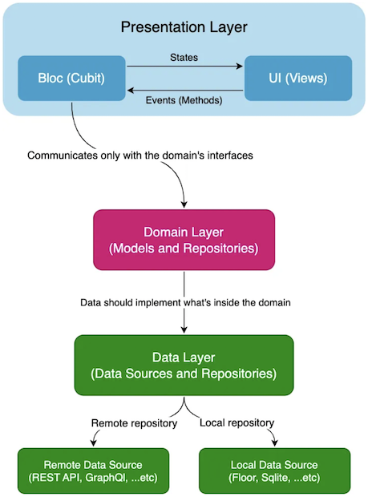

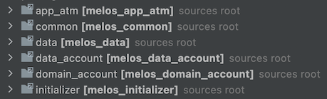

This project uses Clean Architecture for abstraction and separation of module.

By implementing this architecture, project will be clean, easy to read, scalable, maintainable, and testable module by module

This will also help project manager in team management to separate workload and team responsibility.

[back to top](#table-of-contents)

## Application Features
This app only has one page, Home as command line interface. 

Inside this page, there are several command that user can typed:
### 1. login `[username]`

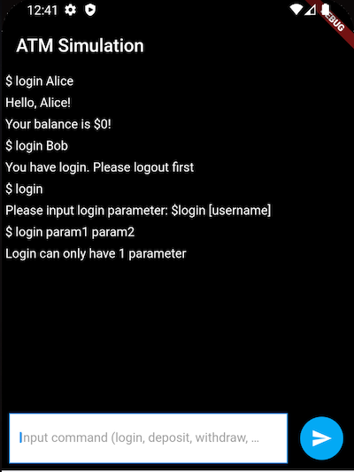

`Login` will create account in persistent storage with initial 0 balance.

There are several validation that has been added. eq: no input parameter, too much parameter.

### 2. deposit `[amount]`

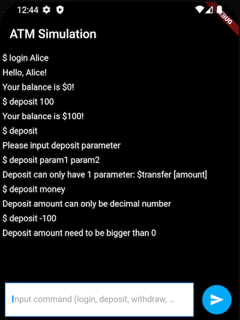

`Deposit` will add balance based on `amount` to current login account.

There are several validation that has been added. eq: authentication error, no input parameter, too much parameter, decimal parameter, number range parameter, insufficient balance.

### 3. withdraw `[amount]`

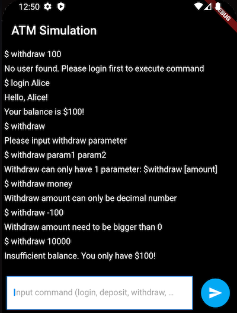

`Withdraw` will subtract balance based on `amount` to current login account.

There are several validation that has been added. eq: authentication error, no input parameter, too much parameter, decimal parameter, number range parameter.

4. transfer `[transfer_to]` `[amount]`

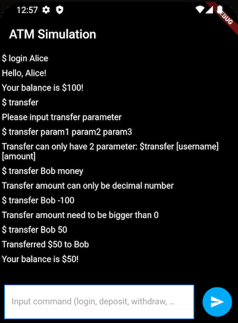

`Transfer` will add balance to other account `transfer_to` and subtract balance to current login account based on `amount`

There are several validation that has been added. eq: authentication error, no input parameter, too much parameter, decimal parameter, number range parameter.

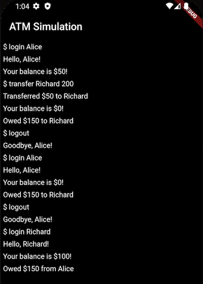

If the `amount` exceed the user balance, it will be marked as `owed` to `transfer_to` account.

This also will be shown when the user login as `owed $[amount] to [user]` or `owed [amount] from [user]`

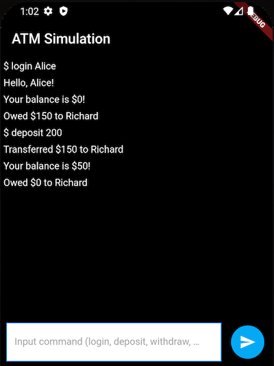

When user with `owed` do a `deposit` command, the `owed` will be paid first before the balance is added 

5. logout

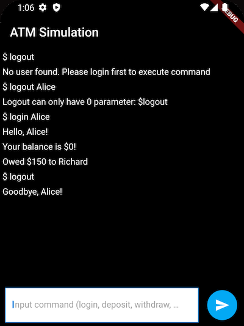

`Deposit` will close session of current login account.

There are several validation that has been added. eq: authentication error, too much parameter.

6. unrecognized command

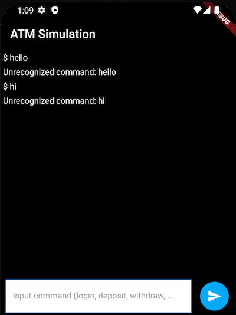

Other than 5 command above, will be marked as `unrecognized command`.

[back to top](#table-of-contents)

## Code Coverage
Clean architecture with unit test and widget test allow Author to achieve `100%` code coverage

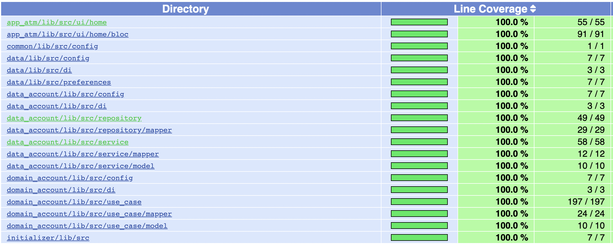

The html coverage report is also included in this project [here](coverage_report/html/index.html)
```
coverage_report/html/index.html
```

[back to top](#table-of-contents)
